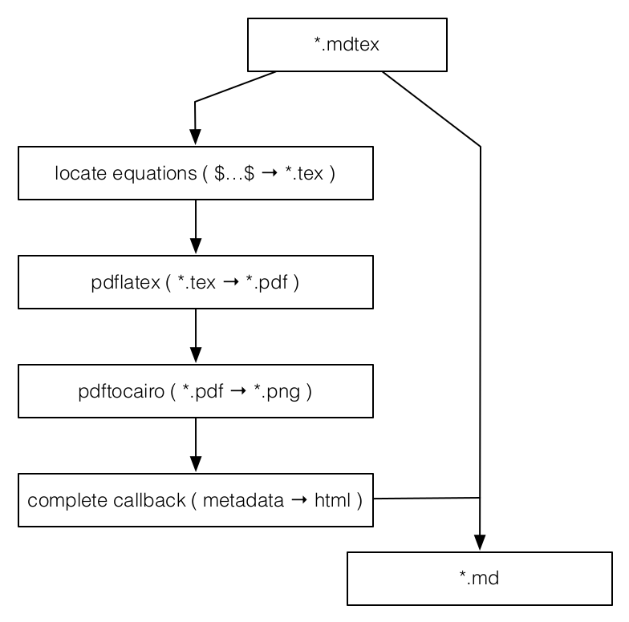

# gulp-markdown-equations

A gulp plugin that makes it easy to replace latex equations in a markdown file with rendered images


## Introduction

This module exposes the tools necessary to to substitute  equations in a markdown document with rendered raster or vector images. It uses the [transform-markdown-mathmode](https://www.npmjs.com/package/transform-markdown-mathmode) node module to locate and transform equations and reconnects with the gulp pipeline after the results have been rendered to complete the transformation using information from the result.

This means you can just mix  into your markdown document. For example,

```markdown
It handles inline equations like $\nabla \cdot \vec{u} = 0$ and display equations like $$\frac{D\rho}{Dt} = 0.$$
```

gets transformed into:

It handles inline equations like  and display equations like <p align="center"></p>

Of course it's gulp plugin though, so that means you can really do whatever you want with it!

## Example

The following is a gulp task that locates equations in markdown, renders them, and lets you do whatever you want with the result! First things first, here's the data flow:

<p align="center"></p>

```javascript
var gulp = require('gulp')
  , mdEq = require('gulp-markdown-equations')
  , tap = require('gulp-tap')
  , filter = require('gulp-filter')
  , latex = require('gulp-latex')
  , pdftocairo = require('gulp-pdftocairo')


gulp.task('mdtex',function() {

  var texFilter = filter('*.tex')
  var mdFilter = filter('*.md')

  // Instantiate the transform and set some defaults:
  var eqSub = mdEq({
    defaults: {
      display: { margin: '1pt' },
      inline: {margin: '1pt'}
    }
  })

  return gulp.src('*.mdtex')
    .pipe(eqSub)

    // Filter to operate on *.tex documents:
    .pipe(texFilter)

    // Render the equations to pdf:
    .pipe(latex())

    // Convert the pdf equations to png:
    .pipe(pdftocairo({format: 'png'}))

    // Send them to the images folder:
    .pipe(gulp.dest('images'))

    // Match the output images up with the closures that are still waiting
    // on their callbacks from the `.pipe(eqSub)` step above. That means
    // we can use metadata from the image output all the way back  up in
    // the original transform. Sweet!
    //
    .pipe(tap(function(file) {
      eqSub.complete(file,function(cb,meta) {
        var img = ''
        meta.display ? cb('<p align="center">'+img+'</p>') : cb(img)
      })
    }))

    // Restore and then change filters to operate on the *.md document:
    .pipe(texFilter.restore()).pipe(mdFilter)

    // Output in the current directory:
    .pipe(gulp.dest('./'))
})
```

The task is the run with

```bash
$ gulp mdtex
```


## API

API documentation in its way!


## Installation

To install, run

```bash
$ npm install gulp-markdown-equations
```


## Testing

Tests on the way too...

## Credits

(c) 2015 Ricky Reusser. MIT License